# OpenAPI
Plugin to enable OpenAPI 3 as a target in Hackolade data modeling.

For each object in Hackolade, we've defined a set of standard properties that appear in the properties pane.  But it is possible that your company wants to define and track additional properties for models, containers, entities, and attributes.  Hackolade let's you do just that, by leveraging our plugin architecture (used also to integrate our modeling engine with all kinds of NoSQL document databases.)

  

## 1) Download and enable plugin

To enable the custom properties capability, you first need to download a plugin for each database target for which you wish to add properties.  To do so, go to Help > DB Target Plugin Manager

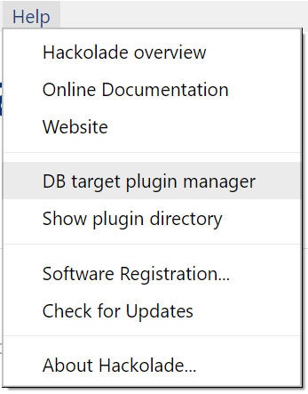

  

You may choose which plugin to install on your computer.

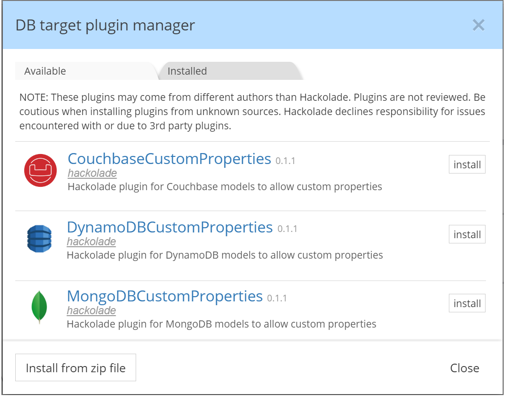

  

This will result in the plugin appearing in the Installed tab of the plugin manager.

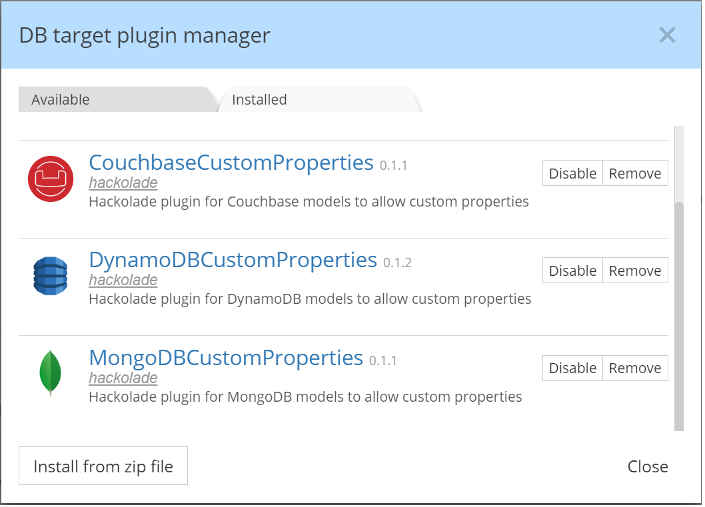

  

## 2) Access plugin configuration files

You are now ready to add custom properties via editing of configuration files.  The plugin configurations files can be found by going to Help > Show plugin directory:

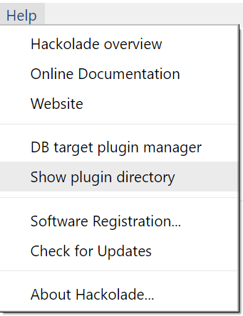

  

For each custom properties plugin, you will find the a directory structure similar to this one:

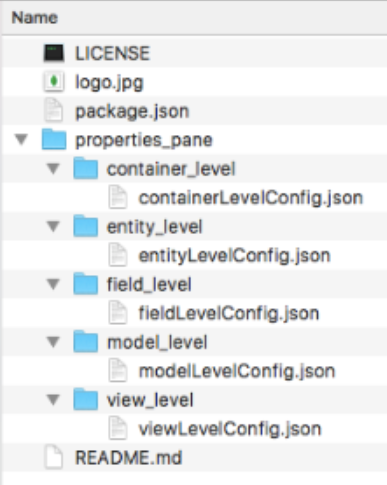

Notes:

i) do NOT make any changes to the package.json file!  Only the <object>LevelConfig.json files should be edited according to the specifications below.

ii) it is advised to keep a backup of the files before making changes, so you can revert back in case of errors.

iii) it is always necessary to restart the application after having saved changes before you can see these changes relected in the properties pane.

iv) for field-level definitions, since field types have different property lists, it may be necessary to define custom properties for multiple field types.

## 3) Levels

As a reminder, terminology differs between NoSQL database:

- container means: dbs in MongoDB, region in DynamoDB, bucket in Couchbase, collection in Cosmos DB

- entity means: collection in MongoDB, table in DynamoDB, document kind in Couchbase, and document type in Cosmos DB

- field means: field in MongoDB, Couchbase, and Cosmos DB.  And attribute in DynamoDB

  

You need to edit the corresponding <object>LevelConfig.json file to add custom properties.

  

## 4) Lower tabs

For each level, the Hackolade properties pane may have one or more lower tab:

- MongoDB model lower tab:

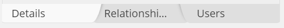

- MongoDB dbs lower tab:

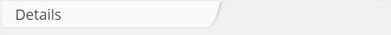

- MongoDB collection lower tab:

- MongoDB field lower tab:

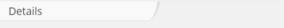

  

If the level allows multiple tabs, you need to choose to which lower tab you want to add properties.

  

## 5) Property types

The following controls are possible for user-defined properties:

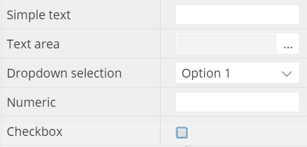

*   simple text: one line of text
*   text area: popup for multi-line text entry
*   dropdown selection from a deined list of options
*   numeric-only field
*   checkbox: for true/false entry  
      
    

  

## 6) Property definition

Examples are provided in the comments section of each config file.  Here's an overview of the schema:

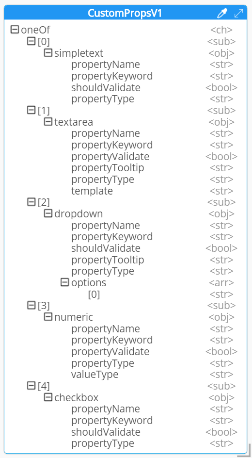

Here's another view, consolidated:

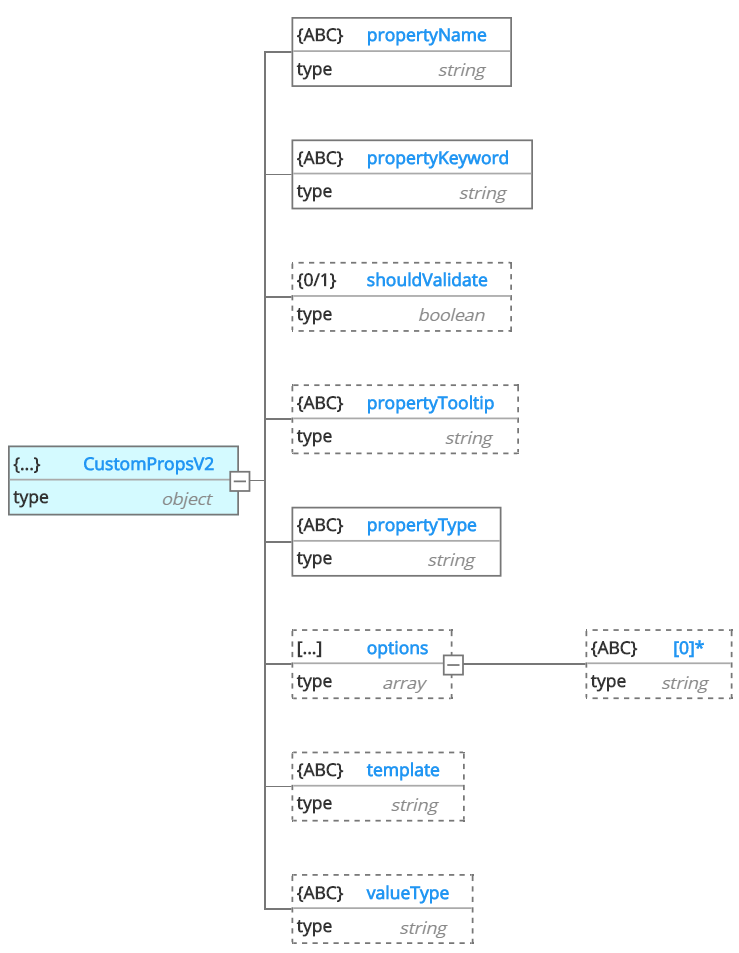

- propertyName: mandatory, this is the property label that will appear in the Property Pane

- propertyKeyword: mandatory, this is the unique key for the property

- shouldValidate: optional, boolean true/false to define whether to validate the regular expression of the text input [default: false]

- propertyTooltip: optional, in the case of input types textarea and select, it is possible to display a tooltip  defined here

- propertyType: mandatory, this is the control definition, with possible values: text, details, select (i.e. dropdown), checkbox

- options: optional, this is the array of possible checkbox options

- template: optional, this is needed in the case of propertyType = details, to define a popup multi-line text.  Possible value: textarea

- valueType: optional, this is needed in to specify that a property is numberic only.  Possible values: numeric

  

## 7) Share customization with team members

After making, saving and testing your changes, you should share them with everyone on your team to insure consistency. This is a 3-step process:

- return to the plugin directory via Help > Show plugin directory, and zip up the whole plugin directory where you made your changes;

- transfer this zip file to each team member using Hackolade;

- on each team member's computer, start Hackolade, go to Help > DB target plugin manager, then click the button 'Install from zip file', and choose the zip file file.

  

For the changes to take effect on each computer, it is required to exit Hackolade and restart it.

  

</article>

