# OpenAPI
Plugin to enable OpenAPI 3 as a target in Hackolade data modeling.

OpenAPI Specification or OAS (formerly known as Swagger Specification) is an open-source format for describing and documenting APIs. It has become a de-facto standard, language-agnostic interface for designing and describing RESTful APIs which allow both humans and computers to discover and understand the capabilities of the service without access to source code, documentation, or through network traffic inspection.  When properly defined via OpenAPI, a consumer can understand and interact with the remote service with a minimal amount of implementation logic.The latest version of OpenAPI is 3.0.2. OpenAPI definitions can be written in JSON or YAML.

  

OpenAPI is a [formal specification](https://github.com/OAI/OpenAPI-Specification/blob/master/versions/3.0.2.md) surrounded by a large ecosystem of tools, which includes everything from front-end user interfaces, low-level code libraries and commercial API management solutions.

  

To perform model-first design of a REST API using OpenAPI 3 with Hackolade, you must first download the OpenAPI [plugin](DownloadadditionalDBtargetplugin.html).  This plugin is strictly compliant with version 3.0.2 of the OpenAPI specification.  If you need support version 2 of the specification (a.k.a. Swagger) you need another plugin described [here](SwaggerAPI.html).

  

Creating APIs is not easy! And writing OpenAPI documentation in a design-first approach can be tedious at best, generally error-prone and frustrating...  Hackolade takes a visual schema-centric approach so you can focus on the content of requests and responses. The application also assists with all the metadata to produce validated OpenAPI files and test the transactions.  You can also reverse-engineer existing OpenAPI 3 files in JSON or YAML to produce a graphical representation of your APIs.

Hackolade was specially adapted to support the API design of OAS, including all the necessary metadata for the API, the requests and responses.  The application closely follows the terminology of the specification.  The visual tool puts the focus on what really matters in an API: the schema of the information being exchanged between systems.  At the same time, it provides assistance to modelers and does not require perfect mastery of the OpenAPI 3 syntax.  It generates validated files that are syntactically correct and compatible with the specification thereby greatly improving productivity and quality.

  

The diagram below results from the reverse-engineering of the [Pet Store](https://mermade.org.uk/examples/openapi.json) sample API.

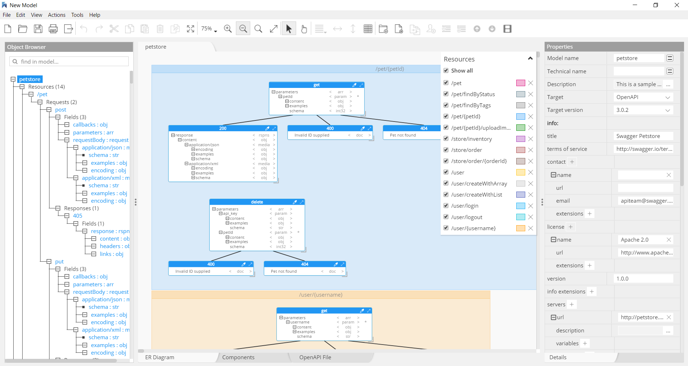

  

Note the toolbar button to toogle the level of details displayed in the ER Diagram view.  

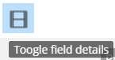

  

By default Hackolade displays all the various ways an API can be defined in OpenAPI.  Once you're done creating your design, you may wish to hide the extraneous structures and adjust the layout to take advantage of the extra real estate on screen.

  

## Data Types

The OpenAPI specification describes primitives (or scalar) data types which can have an optional property modifier, format, plus a file primitive type.  Complex types such as arrays and sub-objects, plus combinations thereof, are also allowed.

  

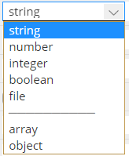 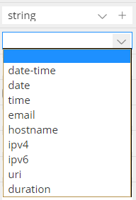 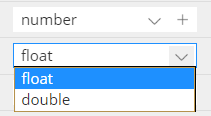 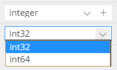 

  

## API metadata

The info object, as well as the host, basePath, schemes, consumes, produces, the securityDefinitions object, the security object, the tags object, and externalDocs object are fixed fields treated as metadata and maintained at model-level in Hackolade.

  

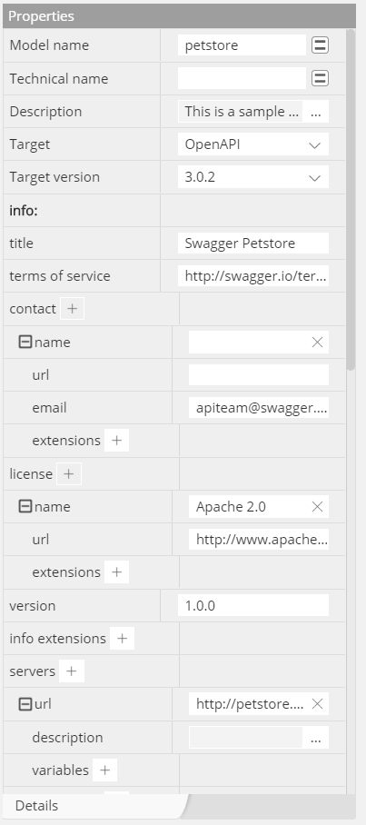 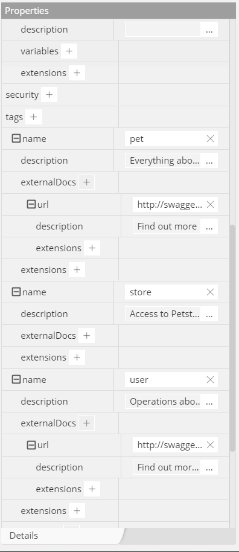 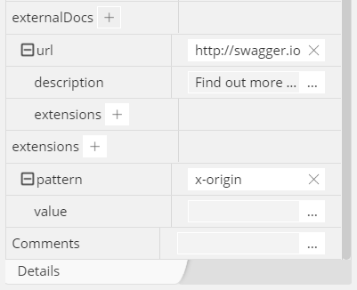

  

## Components

[Component objects](https://github.com/OAI/OpenAPI-Specification/blob/master/versions/3.0.2.md#components-object) hold a set of reusable objects that can be used across multiple endpoints in the same API: schema, parameter, request body, response, example, header, security scheme, link, or callback. All objects defined within the components object will have no effect on the API unless they are explicitly referenced from properties outside the components object by using a $ref reference in any path item.

  

As you expose more resources and operations against your API, your API may repeat a lot of existing parameters or response descriptions in many different paths and operations.  By creating reusable component objects, you avoid time-consuming rewriting as well as the risk of inconsistencies.

  

Data types can be objects, but also primitives and arrays. This object is based on the [JSON Schema Specification Wright Draft 00 (a.k.a. Draft-05)](http://json-schema.org/) and uses a predefined subset of it. On top of this subset, there are extensions provided by this specification to allow for more complete documentation.

  

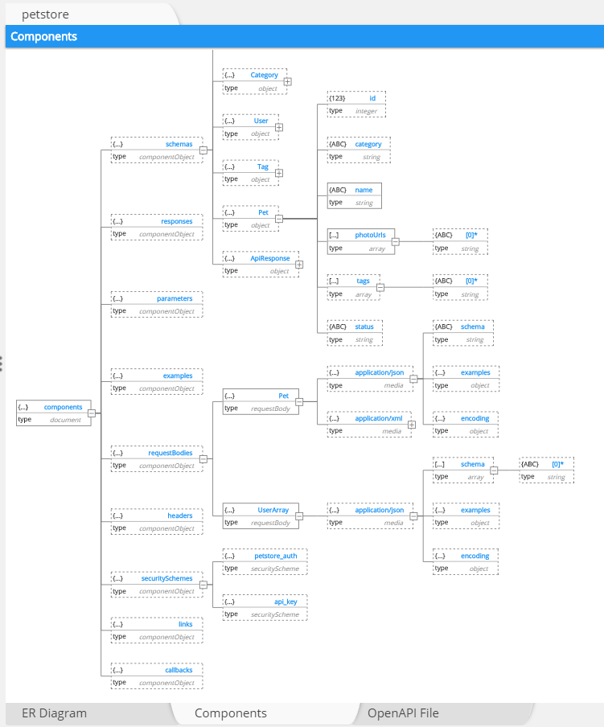

  

Consult [this page](Reusableobjectsdefinitions.html) or more information on how to use definitions.  For OpenAPI, you should limit yourself to Hackolade model definitions.

## Resource

The resource path object is a container representing the relative path to an individual endpoint.  The field name must start with a slash ("/").  The path is appended to the basePath in order to construct the full URL.  Path templating (usage of curly braces ("{}") to mark a section of a URL path as replaceable using path parameters) is allowed.

  

Each resource contains one or more "[path item objects](https://github.com/OAI/OpenAPI-Specification/blob/master/versions/3.0.2.md#pathItemObject)" made of a request and one or more responses:

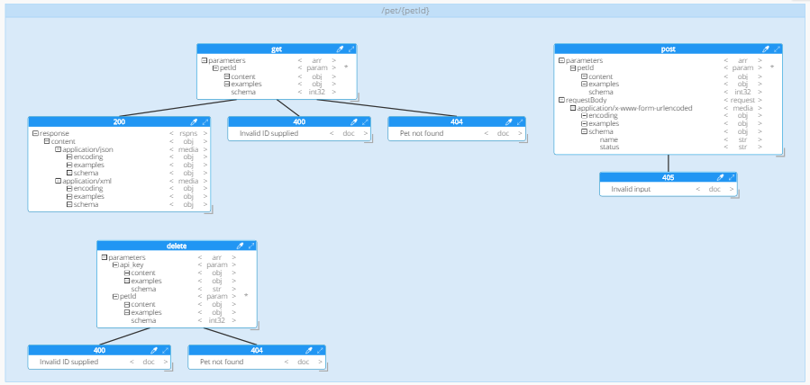

  

You may create a new resource via right-click anywhere in the ERD view and choosing the contextual menu option:

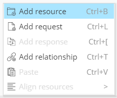

  

or via the menu:

  

or the toolbar:

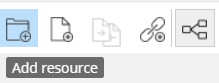

  

## Requests

A request is an object with a type, associated data, relationships to other resources, and a set of methods that operate on it.  Only a few standard methods are defined for the resource (corresponding to the standard HTTP GET, POST, PUT and DELETE methods.)

  

The [Parameter Object](https://github.com/OAI/OpenAPI-Specification/blob/master/versions/3.0.2.md#parameterObject) describes a single operation parameter defined by a combination of a name and location.  Hackolade provides a handy template of parameter types allowing the description of the payload either by adding adding individual fields or by referencing an existing component:

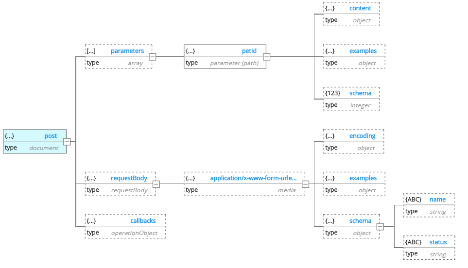

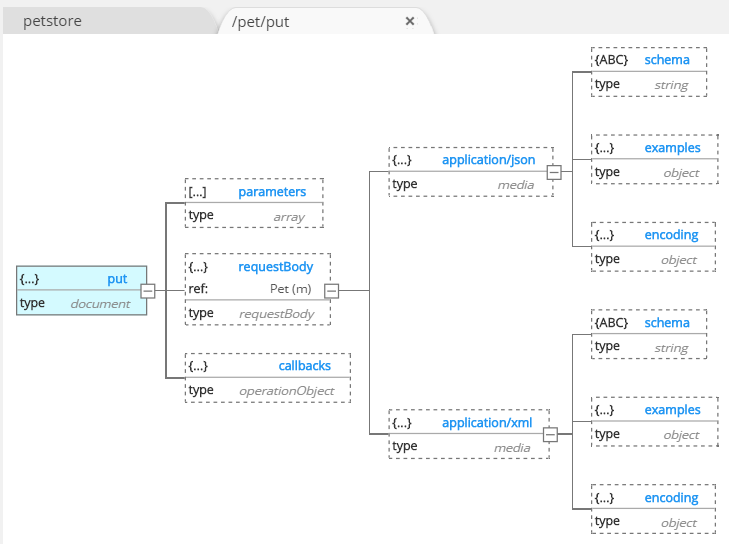

  

To create a request within a resource container, you may:

- right-click inside the container area of the ERD pane, and choose the contextual menu option:

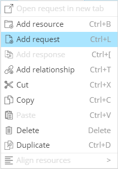

- choose the Action menu:

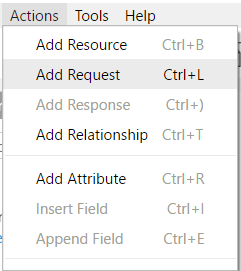

- choose the toolbar button:

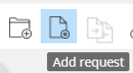

  

It is easy to maintain the metadata for a request in the properties pane:

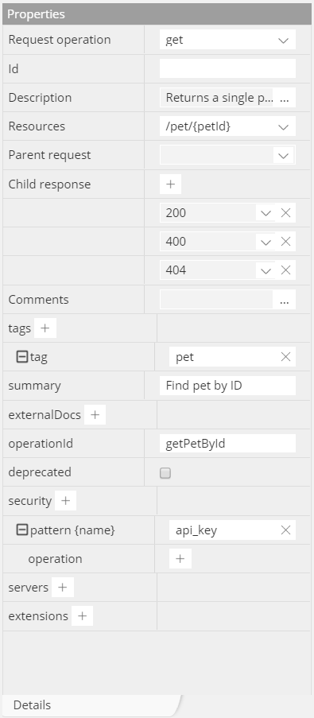

  

## Responses

[Response objects](https://github.com/OAI/OpenAPI-Specification/blob/master/versions/3.0.2.md#responses-object) describe responses from API operations.  For each request, you may create one or more responses.

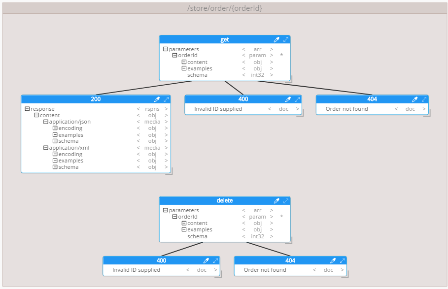

  

A response may have a schema that is defined as individual fields or references a component:

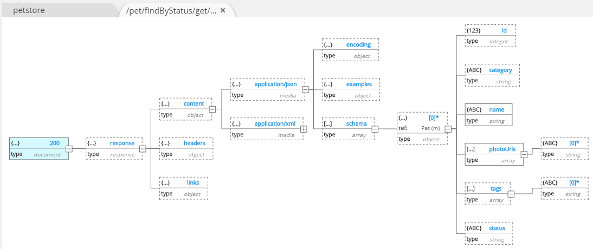

  

To create a response for a given request, you may:

- right-click on the request in the ERD and choose the contextual menu option:

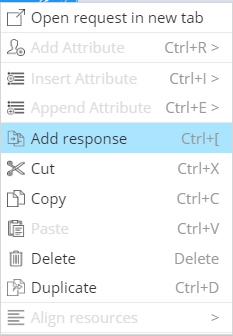

- or choose the Action menu:

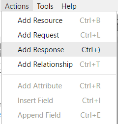

- or choose the toolbar button:

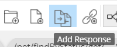

  

It is easy to maintain the metadata for a response in the properties pane:

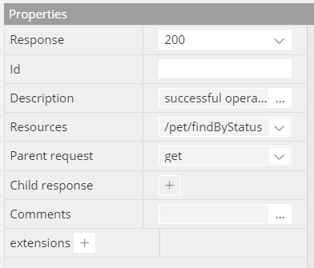

  

## Forward-Engineering

The files describing the RESTful API in accordance with the OpenAPI specification OAS are represented as JSON objects and conform to the JSON standards.  Hackolade generates OpenAPI documentation in JSON format or YAML format.  The schema exposes two types of fields. Fixed fields, which have a declared name, and patterned fields, which declare a regex pattern for the field name. Patterned fields can have multiple occurrences as long as each has a unique name.  The OpenAPI representation of the API is made of a single file. However, parts of the definitions can be split into separate files, at the discretion of the user. This is applicable for $ref fields in the specification as follows from the [JSON Schema](http://json-schema.org/)  definitions.

  

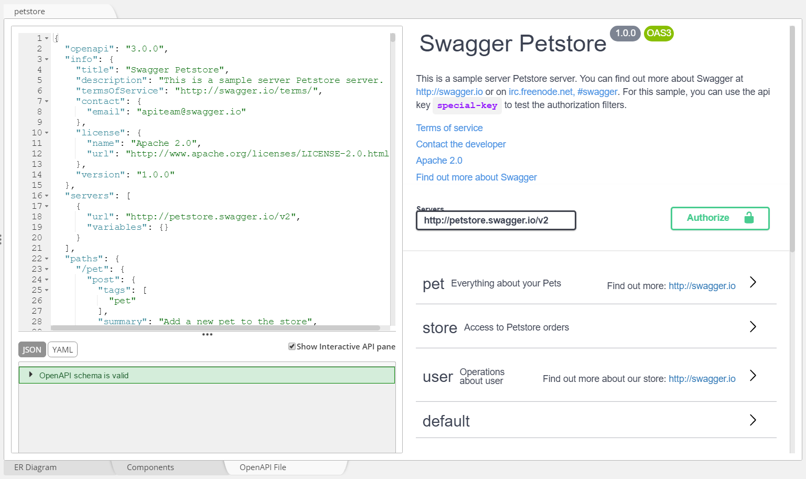

  

An internal OpenAPI syntax validator ensures that the generated file is valid, and the right-hand pane allows interactions with the API and testing.

  

## Reverse-Engineering

This function lets you take a OpenAPI file in JSON or YAML format and generate a Hackolade model.  Then, you may enrich the model with comments, generate standard Hackolade documentation, and make the API evolve to generate a new OpenAPI file through forward-engineering.